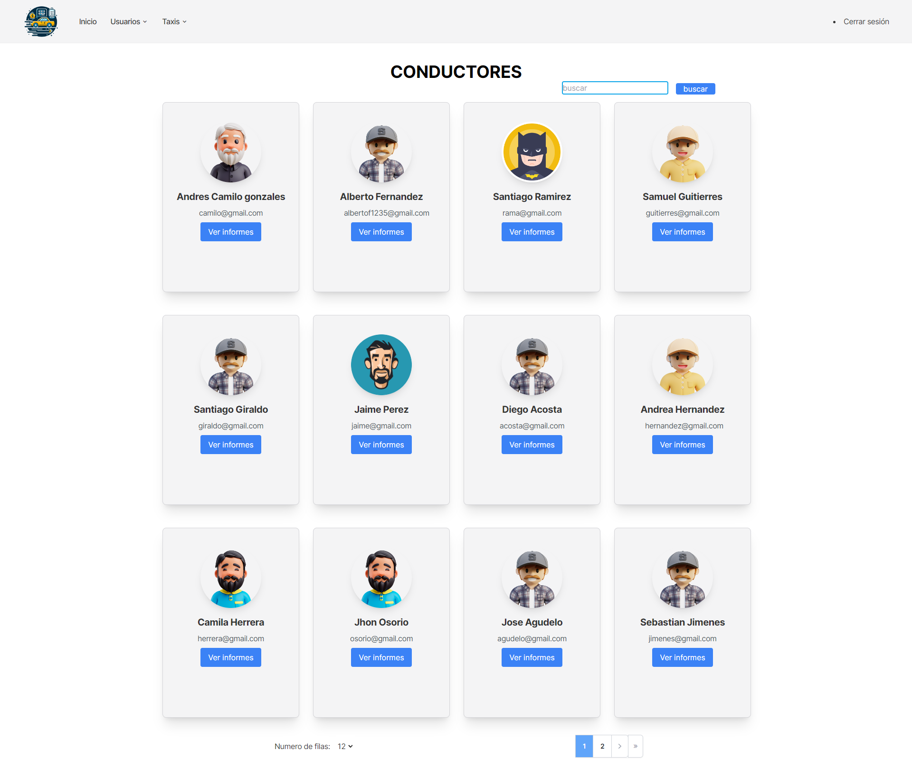

[](https://www.codefactor.io/repository/github/midnightgb/taxicontrolsystem)
[](readme-es.md) For the spanish version
# TaxiControlSystem
TaxiControlSystem - Fleet management software for efficient taxi operations

# Screenshots
### Login
{width=900px}

### Dashboard
{width=900px}

## Drivers
{width=900px}

#### Driver Registration
{width=900px}

#### Driver Reports
{width=900px}

#### Driver Report Payment
{width=900px}

#### Driver Report Update Payment
{width=900px}

#### Driver Report Update Vehicle Information
{width=900px}

#### Driver Report Update Driver Information
{width=900px}

## Vehicles
{width=900px}

#### Vehicle Registration
{width=900px}

#### Vehicle Reports
{width=900px}

#### Vehicle Maintenance
{width=900px}

# For Bug Reporting
### Please create an issue with the following information
```bash
1. What you were trying to do
2. What you expected to happen
3. What actually happened
4. Steps to reproduce the problem
5. Screenshots if possible
```

# For live demo
## Install Python dependencies
you need to be in the app directory to run the following commands
```bash
conda create --name taxicontrol python=3.9 
conda activate taxicontrol
pip install -r requirements.txt
```

## Create the database
```bash
insert TaxiControlSystemDATA.sql into your database management system
```

## Run the app
```bash
uvicorn main:app --reload
```

# Login credentials
```bash
username: "1234" or "admin@admin.com"
password: admin
```

# Only for development

## Install NodeJS dependencies
you need to be in the app directory to run the following commands
```bash
npm install
```

## Run TailwindCSS
```bash
npx tailwindcss -i ./public/dist/css/tailwind/input.css -o ./public/dist/css/tailwind/output.css --watch
```
