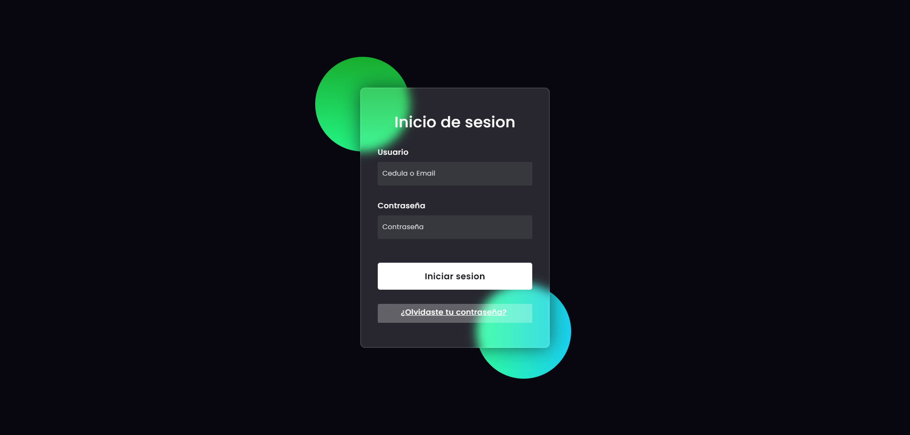
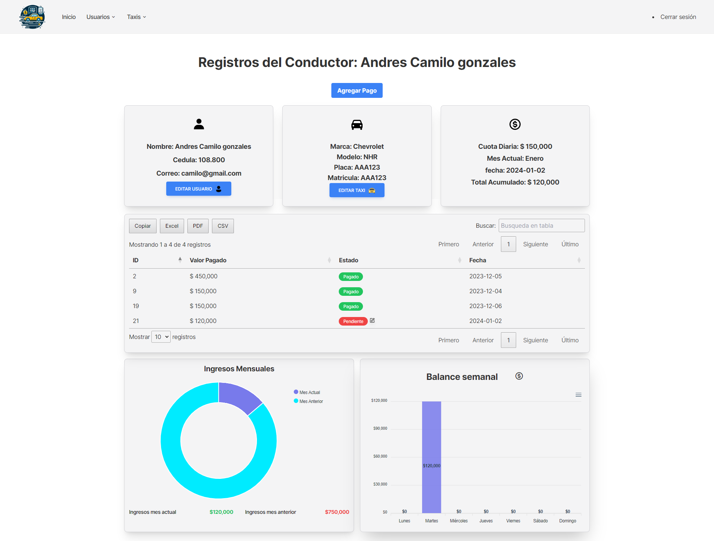
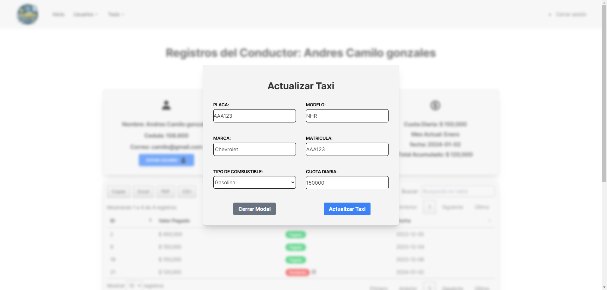
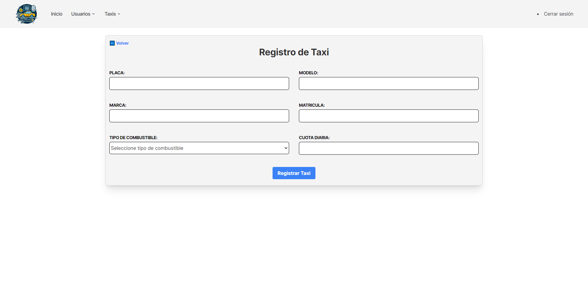
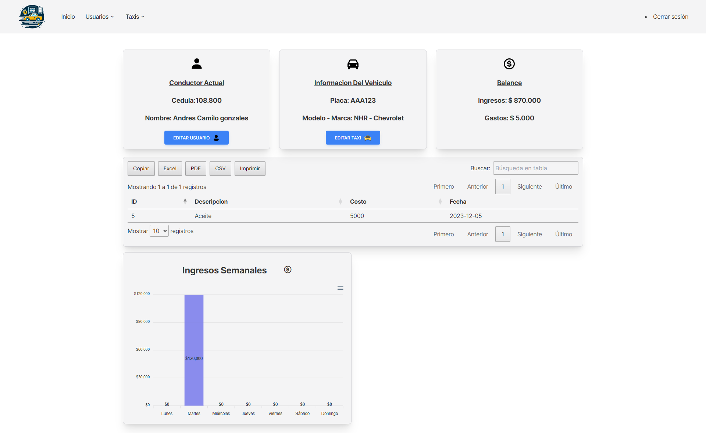

[](https://www.codefactor.io/repository/github/midnightgb/taxicontrolsystem)
[](README.md) For the english version
# TaxiControlSystem
TaxiControlSystem - Software de gestión de flotas para operaciones de taxi eficientes

# Capturas de pantalla
## Inicio de sesión


## Panel de control


## Conductores


### Registro de conductor


### Informes de conductores


### Pago del conductor


### Actualizar pago del conductor


### Actualizar información del vehículo


### Actualizar información del conductor


## Vehículos


### Registro de vehículos


### Informes de vehículos


### Mantenimiento de vehículos


# Para informar de errores
## Cree un problema con la siguiente información
```bash
1. Lo que estabas intentando hacer
2. Lo que esperabas que sucediera
3. Lo que realmente sucedió
4. Pasos para reproducir el problema
5. Capturas de pantalla si es posible
```

# Para demostración en vivo
## Instalar dependencias de Python
debe estar en el directorio de la aplicación para ejecutar los siguientes comandos
```bash
pip install -r requirements.txt
```

## Configurar la base de datos
```bash
insert TaxiControlSystemDATA.sql en su sistema de gestión de bases de datos
```

## Ejecutar la aplicación
```bash
uvicorn main:app --reload
```

## Credenciales de inicio de sesión
```bash
usuario: "1234" o "admin@admin.com"
contraseña: admin
```


# Para contribuir
### Instalar dependencias de Python y Configurar la base de datos
## Instalar dependencias de NodeJS
debe estar en el directorio de la aplicación para ejecutar los siguientes comandos
```bash
npm install
```

## Ejecutar TailwindCSS
```bash
npx tailwindcss -i ./public/dist/css/tailwind/input.css -o ./public/dist/css/tailwind/output.css --watch
```


